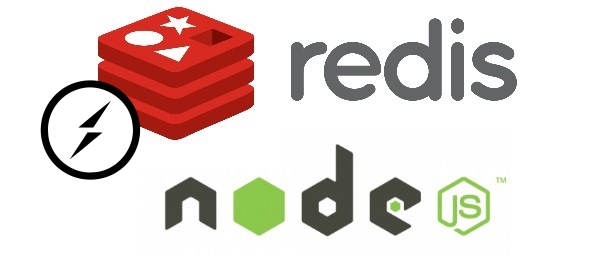

# BookShop Microservices

Nodejs application with microservices ARQ. Using Redis to allow the comunication between microservices. 
When a customer make a order, the stock is updated and the customer balance is updated too, substract book price from customer balance. If customer hasn't enought money, return a error

## Books

Microservice to handle shop books, runs in 5555 port

### Get all books

GET http://localhost/books

### Get a book

GET http://localhost/books/:id'

### Create a new book

POST http://localhost/books/create

### Update a book

POST http://localhost/books/update

### Delete a book

DELETE http://localhost/books/:id

## Customers

Microservice to handler shop customers, runs in 6666 port

### Get all customer

GET http://localhost/customers

### Get a customer

GET http://localhost/customers/:id'

### Create a new customer

POST http://localhost/customers/create

### Update a customer

POST http://localhost/customers/update

### Delete a customer

DELETE http://localhost/customers/:id

## Orders

Microservice to handler shop orders, runs in 7777 port

### Get all orders

GET http://localhost/orders

### Get a order

GET http://localhost/orders/:id'

### Create a new order

POST http://localhost/orders/create

### Update a order

POST http://localhost/orders/update

### Delete a order

DELETE http://localhost/orders/:id